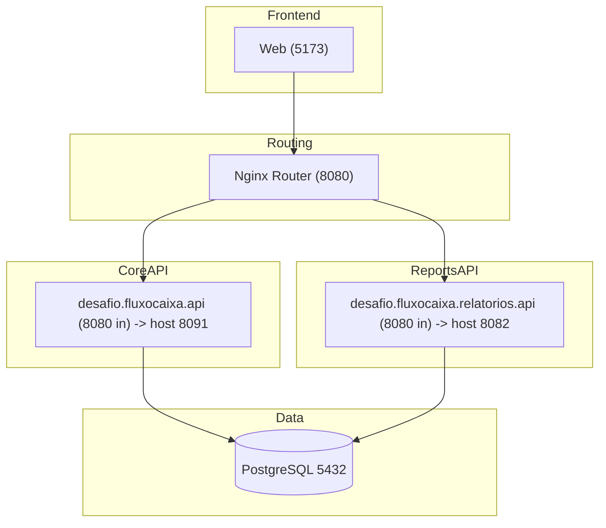

  # Desafio Arquitetura de Solução - Verity
  
  ## Fluxo de Caixa Diário — Clean Architecture + CQRS + JWT (NET 9)

  Aplicação **full-stack** para controle do **fluxo de caixa diário** por usuário. Permite registrar **lançamentos** de **Débito/Crédito**, consultar por período e gerar **relatório consolidado** com **saldo do dia** e **saldo acumulado**, com autenticação segura e telemetria pronta para ambientes de produção.

  **Atualização importante:** a solução foi **separada em dois serviços**:
  - **API Principal (`desafio.fluxocaixa.api`)** — identidade (register/login/refresh/logout) e **lançamentos** (CRUD).
  - **API de Relatórios (`desafio.fluxocaixa.relatorios.api`)** — **saldo diário consolidado** (leitura agregada), **isolada** para escalar e falhar de forma independente.
  
  **Roteamento**: um **Nginx** frontal (`router`) expõe `http://localhost:8080` para o **frontend**, roteando:
  - `/api/v1/relatorios/**` → **Relatórios**
  - `/api/**` → **API Principal**
    
  ---
  
  - **Backend:** .NET 9 C# (ASP.NET Core) com **Clean Architecture + CQRS**, **EF Core (PostgreSQL)** e **migrations**. A API de Relatórios usa **Npgsql** direto (read-only).
  - **Segurança:** **JWT** com **refresh rotativo** e logout individual/global; senhas com **PBKDF2**; **CORS** por ambiente (Nginx + APIs).
  - **Observabilidade:** **Serilog** (logs estruturados) + **OpenTelemetry** (traces/métricas via OTLP).
  - **Frontend:** **React + Vite + TypeScript + Tailwind**, com **componentes reutilizáveis** e gráfico do saldo acumulado.
  - **Execução:** **Docker Compose** (Web, API Principal, API de Relatórios e Postgres) ou execução local via `dotnet run` e `npm run dev`.
  - **Qualidade:** validações (FluentValidation), testes de domínio/aplicação, e documentação com diagramas Mermaid no README.

  ### Funcionalidades
  - **Lançamentos:** criar, listar (por intervalo de datas) e remover.
  - **Relatórios:** obter o **saldo diário consolidado** (débitos, créditos, saldo do dia e acumulado) com **saldo inicial** opcional.
  - **Autenticação:** **cadastro, login, refresh e logout** para manter sessões curtas e seguras.

  ---

  ## Índice
  1. [Requisitos de Negócio](#requisitos-de-negócio)
  2. [Domínios Funcionais e Capacidades](#domínios-funcionais-e-capacidades)
  3. [Requisitos Funcionais e Não Funcionais](#requisitos-funcionais-e-não-funcionais)
  4. [Arquitetura Alvo (com Diagramas Mermaid)](#arquitetura-alvo-com-diagramas-mermaid)
  5. [Justificativas Técnicas](#justificativas-técnicas)
  6. [Operação e Observabilidade](#operação-e-observabilidade)
  7. [Como Rodar Localmente](#como-rodar-localmente)
  8. [Endpoints Principais](#endpoints-principais)
  9. [Estratégia de Branch — GitHub Flow](#estratégia-de-branch--github-flow)
  10. [IDEs Recomendadas (com justificativas)](#ides-recomendadas)
  11. [Licença](#licença)

  ---

  ## Requisitos de Negócio

  **Serviços**:
  - **Serviço de Lançamentos**: cadastro, listagem e remoção.
  - **Serviço de Consolidado Diário**: apuração por data (débitos, créditos, saldo do dia e acumulado).

  **Regras essenciais**:
  - Cada lançamento pertence a **um usuário** e possui **data**, **tipo** (1=Débito, 2=Crédito), **valor** e **descrição**.
  - O relatório consolida por **dia** no intervalo `[de, até]`, com **saldo inicial** opcional.
  - Autenticação obrigatória; o usuário vê **apenas seus próprios dados**.

  ---

  ## Domínios Funcionais e Capacidades

  **Domínios**:
  - **Identidade e Acesso**: cadastro, login, JWT, refresh, logout.
  - **Lançamentos**: registrar, listar, excluir.
  - **Relatórios**: consolidação diária; futuros CSV/PDF.
  - **Plataforma e Observabilidade**: logs, métricas, traces, health.
  - **Segurança e Conformidade**: hashing de senha, CORS/TLS, proteção de dados.

  **Capacidades de Negócio**:
  - **Gerir Usuário** (onboarding, autenticação, sessão).
  - **Gerir Lançamentos** (CRUD básico).
  - **Apurar Saldo Diário** (consolidação por data + acumulado).
  - **Disponibilizar Relatórios** (UI + gráfico).
  - **Operar com Confiabilidade** (migrations, monitoramento, auditoria mínima).

  ---

  ## Requisitos Funcionais e Não Funcionais

  **Funcionais**
  1. **Cadastro de Usuário** (`POST /auth/register`): cria conta com validação de `userName`, `email` e força mínima de senha; retorna 201 ou erros de validação.
  2. **Login** (`POST /auth/login`): autentica por `userNameOrEmail + password`; emite `accessToken` (curta duração) e `refreshToken` (longa duração) para manter sessão.
  3. **Refresh de Token** (`POST /auth/refresh`): renova a sessão de forma **rotativa** (novo refresh invalida o anterior), sem pedir credenciais novamente.
  4. **Logout** (`POST /auth/logout`): finaliza sessão revogando o refresh **atual** ou **todos** os dispositivos do usuário.
  5. **Criar Lançamento** (`POST /lancamentos`): registra **débitos** (1) e **créditos** (2) com `data`, `valor` numérico e `descrição`; vinculado ao usuário autenticado.
  6. **Listar Lançamentos** (`GET /lancamentos?de&ate`): consulta por período, ordenado; pensado para paginação futura sem quebrar contrato.
  7. **Remover Lançamento** (`DELETE /lancamentos/{id}`): exclusão lógica/física conforme estratégia; garante isolamento por usuário.
  8. **Relatório de Saldo Diário** (`GET /relatorios/saldo-diario?de&ate&saldoInicial`): consolida por dia (débitos, créditos, saldo do dia e **acumulado**) com **saldo inicial** 

  **Não Funcionais**
  - **Segurança**: JWT + refresh rotativo; PBKDF2 (100k iterações+); CORS por ambiente; TLS em produção.
  - **Desempenho**: p95 CRUD < 200ms; relatório < 400ms em períodos de até 90 dias.
  - **Escalabilidade**: API stateless (horizontal); Postgres com tuning/replicas; materiais/ETL futuro para janelas extensas.
  - **Resiliência**: health-checks, logs estruturados, métricas e traces OTel; migrations automatizadas controladas.
  - **Observabilidade**: Serilog (console/JSON), OpenTelemetry (NetCore, HttpClient, EF).
  - **Manutenibilidade**: Clean Architecture + CQRS, testes do domínio (saldo).
  - **Portabilidade**: Docker Compose e CLI (`dotnet`, `npm`).

  **Critério não funcional específico (picos e isolamento)**  
  > “O serviço de controle de lançamento **não deve ficar indisponível** se o sistema de consolidado diário cair. Em dias de pico, o serviço de consolidado recebe **50 req/s**, com no máximo **5%** de perda.”
  
  **Como foi atendido**:
  - **Separação física** em dois serviços e **roteamento** por Nginx. Se **Relatórios** cair, o **CRUD** continua saudável.
  - **Escala independente**: `desafio.fluxocaixa.relatorios.api` pode receber **réplicas** sem tocar na API Principal.
  - **Consulta read-only otimizada** (Npgsql + SQL agregado, índices por `(UserId, Data)`), reduzindo pressão no EF/DbContext do CRUD.
  - **Timeouts** no Nginx e (opcional) no HttpClient consumidor do Relatórios para conter **backpressure**; perdas até 5% sob pico ocorrem por **timeout** controlado no **Relatórios**, preservando o **SLO** do CRUD.
  - **Evolução (futuro): CQRS a nível de banco** — particionar **escrita** (master) e **leitura** (read-replicas) para o domínio de relatórios, reduzindo latência e isolando carga de consultas intensivas.
  
  ---

  ## Arquitetura Alvo (com Diagramas Mermaid)

  ### Contexto (alto nível)
  ```mermaid
  flowchart LR
    U[Usuário] -->|SPA| Web["WebApp (React/Vite)"]
    Web -->|HTTP + JWT| Edge[Nginx Router]
  
    Edge -->|/api/**| Api["API Principal (.NET 9)"]
    Edge -->|/api/v1/relatorios/**| Rep["API de Relatórios (.NET 9)"]
  
    Api -->|EF Core| DB[(PostgreSQL)]
    Rep -->|"Npgsql (read-only)"| DB
  
    Api -->|OTLP| OTel[OTel Collector/APM]
    Rep -->|OTLP| OTel
  ```


  ### Contêineres


  ### Componentes (visão de camadas)
  ```mermaid
  flowchart LR
    subgraph API_Principal
      C1["Controllers (Auth/Lançamentos)"]
      A1["Application (Commands/Queries + MediatR)"]
      D1["Domain (User/Lancamento/...)"]
      I1["Infrastructure (EF Core, JWT, PBKDF2)"]
      C1 --> A1 --> I1
      A1 --> D1
    end
  
    subgraph API_Relatorios
      C2["Controllers (Reports)"]
      A2["Application (Commands/Queries + MediatR)"]
      D2["Domain (Report)"]
      I2["Infrastructure.(Npgsql)"]
      C2 --> A2 --> I2
      A2 --> D2
    end
  ```

  ### Modelo de Dados (ER)
  ```mermaid
  erDiagram
      USERS {
        uuid Id PK
        string UserName
        string Email
        string PasswordHash
        timestamptz CreatedAt
      }

      LANCAMENTOS {
        uuid Id PK
        uuid UserId FK
        date Data
        int Tipo  "1=Débito, 2=Crédito"
        numeric Valor "14,2"
        text Descricao
      }

      REFRESH_TOKENS {
        uuid Id PK
        uuid UserId FK
        text TokenHash
        timestamptz ExpiresAt
        timestamptz CreatedAt
        timestamptz RevokedAt
        text ReplacedByTokenHash
        text UserAgent
        text IpAddress
      }

      USERS ||--o{ LANCAMENTOS : "possui"
      USERS ||--o{ REFRESH_TOKENS : "emite"
  ```

  ### Sequência — Criar Lançamento
  ```mermaid
  sequenceDiagram
    autonumber
    actor User as Usuário
    participant Web as WebApp
    participant API
    participant DB as PostgreSQL

    User->>Web: Preenche (data, tipo, valor, desc) e envia
    Web->>API: POST /api/v1/lancamentos (Bearer)
    API->>DB: INSERT lancamentos
    DB-->>API: OK (id)
    API-->>Web: 201 Created
    Web-->>User: Atualiza tabela
  ```

  ### Sequência — Relatório de Saldo Diário (via Nginx)
  ```mermaid
  sequenceDiagram
    autonumber
    actor User as Usuário
    participant FE as WebApp
    participant NX as Nginx Router
    participant REP as Relatórios API
    participant DB as PostgreSQL
  
    User->>FE: Solicita relatório (de/até, saldoInicial)
    FE->>NX: GET /api/v1/relatorios/saldo-diario (Bearer)
    NX->>REP: Proxy da requisição
    REP->>DB: SELECT agregações por dia (UserId, Data)
    DB-->>REP: Débitos/Créditos por dia
    REP->>REP: Calcula saldo do dia e acumulado
    REP-->>NX: 200 JSON
    NX-->>FE: 200 JSON
    FE-->>User: Tabela + Gráfico
  ```

  ### Deployment — Dev e Produção
  ```mermaid
  flowchart LR
    subgraph Dev
      DevFE[Web 5173]
      DevNX[Nginx 8080]
      DevAPI[API Principal host:8091 -> in:8080]
      DevREP[Relatórios host:8082 -> in:8080]
      DevPG[(Postgres)]
      DevFE --> DevNX
      DevNX --> DevAPI
      DevNX --> DevREP
      DevAPI --> DevPG
      DevREP --> DevPG
    end
  
    subgraph Prod
      Edge[Ingress/LB :443]
      WebP["Web (Nginx/static)"]
      ApiP["API Principal (replicas)"]
      RepP["Relatórios (replicas)"]
      PgP["(PostgreSQL Gerenciado + read replicas)"]
      APM[OTLP/APM]
      Edge --> WebP
      Edge --> ApiP
      Edge --> RepP
      ApiP --> PgP
      RepP --> PgP
      ApiP --> APM
      RepP --> APM
    end
  ```

  ---

  ## Justificativas Técnicas
  
  As escolhas foram guiadas pelos requisitos **funcionais** (cadastro/login, lançamentos e relatório consolidado) e **não funcionais** (segurança, desempenho, escalabilidade, resiliência, observabilidade, manutenibilidade e portabilidade). O objetivo é entregar valor rápido, com **qualidade arquitetural** e **rota de evolução** clara.
  
  ### Plataforma e Arquitetura
  - **.NET 9 C# + ASP.NET Core** — runtime performático, DI nativa, pipeline HTTP eficiente e ótimo suporte a JSON/containers.
  - **Clean Architecture + CQRS** — separa domínio/aplicação de infraestrutura/UI; facilita testes e evolução. CQRS permite otimizar caminhos de **escrita** (commands) e **leitura** (queries) sem acoplamento.
  - **MediatR + Behaviors** — centraliza **validação**, **telemetria** e demais *cross-cuttings* no pipeline, reduzindo repetição em controllers/handlers.
  - **Monólito modular (neste escopo)** — menor custo operacional inicial. O particionamento por domínios/capacidades permite extração futura para microserviços **sem reescrever** o core.
  - **Split Core x Relatórios**: **isola falhas** e permite **escalar de forma independente** o caminho de leitura intensiva.  
  - **Relatórios via Npgsql (read-only)**: menor overhead que EF para agregações simples.
  
  ### Persistência e Acesso a Dados
  - **PostgreSQL** — relacional robusto/portável, possui `numeric(14,2)` para valores monetários (sem erros de ponto flutuante).
  - **EF Core (Npgsql)** — produtividade com LINQ, **migrations** versionadas e rastreamento quando necessário. Consultas do relatório usam agregações SQL e **índice `(UserId, Data)`** para período.
  - **Migrations** — aplicadas automaticamente em Dev/Compose; em Produção, recomendadas via *init job* ou pipeline (janela controlada).
  - **Integridade e concorrência** — FKs explícitas, isolamento por usuário. Exclusão de lançamentos **física** (simples), com espaço para evoluir para **lógica** (auditoria) sem quebrar contrato.
  - **Futuro (DB-level CQRS)**: **primário** para escrita + **read-replicas** para leitura (Relatórios).
  
  ### Segurança e Identidade
  - **JWT (HS256)** com `aud/iss/exp/iat/nbf/jti`; **access token** curto (~15 min) e **refresh token** (~7 dias) **rotativo** (novo refresh invalida o anterior). Refresh tokens são armazenados **hasheados** no banco.
  - **Senhas** — **PBKDF2-SHA256** com ≥150k iterações e *salt* único; parâmetros ajustáveis por ambiente (possível **Argon2id** futuro).
  - **CORS/TLS/HSTS** — em Dev libera `http://localhost:5173`; em Prod restringe ao domínio oficial, TLS obrigatório e **HSTS**.
  - **Data Protection Keys** persistidas fora do contêiner para permitir **scale-out**; **rate limiting** em login/APIs para reduzir brute force/abuso.
  - **Logout** por dispositivo (revoga refresh específico) ou **global** (revoga todos).
  - **Por que não OIDC externo agora?** Para o escopo do desafio, autenticação **in-app** é suficiente. A arquitetura aceita plugar IdP (AAD/Auth0/Keycloak) depois via **JWT Bearer/OpenIdConnect** sem grandes refatorações.
  
  ### Frontend
  - **React + Vite + TypeScript** — DX rápida, *hot reload* e *type safety* ponta a ponta; **Vite** produz builds leves com *code-splitting*.
  - **Tailwind** — consistência visual e produtividade; implementamos **componentes reutilizáveis** (Button, Input, Select, Card, Table) como base de um design system simples.
  - **Validação** — **Zod** no registro (feedback imediato); espaço para evoluir com máscaras de moeda, i18n e ARIA/a11y.
  - **Gráficos** — **Chart.js** cobre bem o saldo acumulado; pode migrar para Recharts/ECharts conforme necessidade.
  
  ### Observabilidade e Operação
  - **Serilog** — logs **estruturados** (JSON) com correlação (`traceId/spanId`) e campos de negócio (`userId`, `path`, `statusCode`, `elapsedMs`); fácil rotear para Elastic/CloudWatch/Splunk.
  - **OpenTelemetry** — instrumentação de **AspNetCore**, **HttpClient**, **EF Core** e **Runtime**, exportando via **OTLP** (Tempo/Jaeger/Grafana/Datadog) sem *vendor lock-in*.
  - **Health checks** (startup/liveness/readiness) e **graceful shutdown** compatíveis com K8s/ECS.
  - **12-Factor** — configuração por variáveis de ambiente (`Jwt__Key`, `ConnectionStrings__Postgres`, `OTEL_EXPORTER_OTLP_ENDPOINT`), `.env.example` e Dockerfile multi-stage.
  
  ### Escalabilidade e Evolução
  - **API stateless** atrás de **Load Balancer** — escala horizontal sem *sticky session*.
  - **Banco** — suporte a **read replicas** para leituras intensas e **materialized views/ETL** para janelas muito longas; quando surgirem integrações assíncronas, considerar **Outbox** e **idempotência**.
  - **Estratégia evolutiva** — começar **monolítico** para otimizar *lead time*; migrar para **microserviços por bounded context** quando métricas apontarem ganho real (evita complexidade prematura).
  
  ### Qualidade e Testes
  - **FluentValidation** em comandos; **Behaviors** do MediatR padronizam validação/telemetria.
  - **Testes de Domínio** (saldo diário/acumulado) garantem regra de negócio; **testes de aplicação** cobrem handlers; **integração** com Postgres em contêiner (ou Testcontainers) valida repositórios/EF.
  - **Padrões de código** — Analyzers do .NET, `EditorConfig`, ESLint/TS e (opcional) Prettier (`npm run fmt`).
  
  ### Alternativas consideradas (e por que não agora)
  - **Microserviços desde o início** — eleva custo de operação/observabilidade e orquestração sem necessidade clara neste escopo; **monólito modular** entrega mais rápido com caminho de extração futura.
  - **Event Sourcing** — poderoso para auditoria/temporalidade, mas aumenta complexidade (projeções, replays); requisitos atuais não justificam.
  - **NoSQL** — não há necessidade de esquema flexível nem latência sub-ms; o relacional atende melhor agregações e integridade.
  - **OIDC IdP externo** — agregaria gestão/custos; a solução **in-app** atende e continua interoperável com IdPs no futuro.

  ---

  ## Operação e Observabilidade

  - **Health**: `GET /health`
  - **Migrations**: aplicadas em startup via `Database.Migrate()` (sem `EnsureCreated`).
  - **Logs**: Serilog (Console); sugere-se JSON em prod.
  - **Traces/Métricas**: OTel (AspNetCore, HttpClient, EF, Runtime).
  - **Segurança Operacional**: DataProtection Keys persistidas; segredos via env/secret-manager; CORS por ambiente; TLS em produção.

  ---

  ### Com Docker Compose
  ```bash
  cd build/docker
  docker compose up -d --build
  # Frontend (Vite):         http://localhost:5173
  # Roteador Nginx (API GW): http://localhost:8080
  # Swagger API Principal:   http://localhost:8091/swagger
  # Swagger Relatórios:      http://localhost:8082/swagger
  ```
  
  > **Importante:** mantenha **Jwt__Key/Issuer/Audience iguais** nas duas APIs.  
  > O frontend deve chamar **sempre o Nginx** em `http://localhost:8080`.
  
  ### Sem Docker
  
  **Banco**  
  - Postgres local (5432), DB `fluxodb`, credenciais `app/app` (ou ajuste a string).
  
  **API Principal**
  ```bash
  dotnet restore
  cd src/Desafio.FluxoCaixa.Api
  dotnet run
  # http://localhost:8080 (se ASPNETCORE_URLS=http://+:8080)
  # ou http://localhost:8091/swagger quando rodando via Compose
  ```
  
  **API de Relatórios**
  ```bash
  dotnet restore
  cd src/Desafio.FluxoCaixa.Relatorios.Api
  dotnet run
  # http://localhost:8080 (se ASPNETCORE_URLS=http://+:8080)
  # ou http://localhost:8082/swagger quando via Compose
  ```
  
  **Web**
  ```bash
  cd src/WebApp
  npm ci
  npm run dev
  # http://localhost:5173
  ```
  
  ---
  
  ## Rotas & Portas (Compose)
  
  - **router (Nginx):** `8080 → 80` (host → container)  
    - `/api/**` → **desafio.fluxocaixa.api**  
    - `/api/v1/relatorios/**` → **desafio.fluxocaixa.relatorios.api**
  - **desafio.fluxocaixa.api (API Principal):** `8091 → 8080`  
  - **desafio.fluxocaixa.relatorios.api (Relatórios):** `8082 → 8080`  
  - **desafio.fluxocaixa.web (Vite):** `5173 → 5173`  
  - **db (Postgres):** `5432 → 5432`
  
  ---

  ## Endpoints Principais

  - `POST /api/v1/auth/register` — { userName, email, password }
  - `POST /api/v1/auth/login` — { userNameOrEmail, password } → { accessToken, refreshToken, expiresInSeconds }
  - `POST /api/v1/auth/refresh` — { refreshToken } → rotação
  - `POST /api/v1/auth/logout` — { refreshToken, allDevices? } (se `allDevices=true`, requer Autorização)
  - `GET /api/v1/lancamentos?de=YYYY-MM-DD&ate=YYYY-MM-DD`
  - `POST /api/v1/lancamentos`
  - `DELETE /api/v1/lancamentos/{id}`
  - `GET /api/v1/relatorios/saldo-diario?de=YYYY-MM-DD&ate=YYYY-MM-DD&saldoInicial=0`

  ---

  ## Estratégia de Branch — GitHub Flow

  O repositório segue **GitHub Flow**: histórico linear, `main` sempre estável/deployável, trabalho em **branches curtas** com **pull request** e **CI** obrigatória.
  
  ### Regras
  - **`main`**: sempre verde (build + testes passam). Só recebe **merge via PR**.
  - **Branches de trabalho**: a partir de `main`, pequenas e focadas.  
    Padrões: `feature/<slug-curto>`, `fix/<bugid>-<slug>`, `chore/<tarefa>`, `docs/<topico>`.
  - **Commits**: usar **Commits Semânticos**:  
    `feat: ...`, `fix: ...`, `chore: ...`, `docs: ...`, `refactor: ...`, `test: ...`
  - **Pull Requests**:
    - 1+ aprovação obrigatória; **CI** (build, testes, lint) deve passar.
    - Relacione issue: `Closes #123`.
    - Preferir **squash merge** para manter histórico linear e mensagem limpa.
  - **Versionamento & tags**:
    - **SemVer**: `vMAJOR.MINOR.PATCH`.
    - `feat` → **minor**, `fix` → **patch**; mudanças incompatíveis → **major**.
    - Criar **tag** no merge para gerar release notes, posteriormente podemos avaliar o uso do Google Release Please para automatizar.
  - **Hotfix**:
    - Branch `fix/hotfix-<slug>` a partir de `main`; PR normal com **patch** (ex.: `v1.2.3`).
  - **Proteções de branch**:
    - *Require pull request reviews before merging* (≥1).
    - *Require status checks to pass before merging* (build, testes, lint).
    - *Require branches to be up to date before merging*.

---

  ## IDEs Recomendadas
  
  Escolha a IDE conforme a tarefa; todas funcionam bem no projeto.
  
  ### Visual Studio 2022 (Windows) — Back-end .NET
  **Por que**: Debugger/profiler completos para ASP.NET Core; Test Explorer; integração com Docker e NuGet.  
  **Quando usar**: desenvolvimento e depuração da **API** (.NET 9), testes e profiling.
  
  ### VS Code (qualquer SO) — Frontend React/TypeScript
  **Por que**: leve, extensível, excelente para trabalhar com TypeScript.  
  **Extensões**: **ESLint**, **Prettier**, **Tailwind CSS IntelliSense**, **DotENV**, **REST Client/Thunder Client**, integrado com o GitHub Copilot.
  **Quando usar**: desenvolvimento do **frontend** e edições rápidas no repo.

---

  ## Licença

  MIT — ajuste conforme a necessidade da organização.
